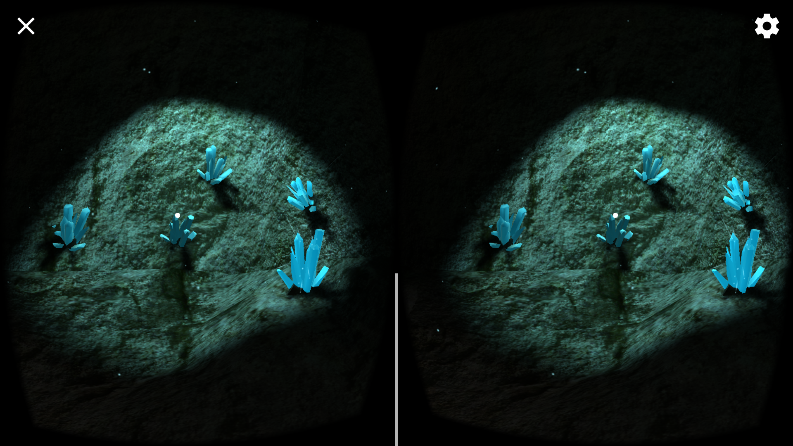

# VR Cave Puzzler Project
Udacity Virtual Reality nanodegree course that I'm taking, is organized around small projects 
dedicated to specific parts of making mobile VR apps. The first project was devoted to becoming familiar with Unity, another one covered a bit of programming.

The project I'll describe here is about VR app design process from scratch to the final product, including user testing, iterations, documentation, etc.

## TL;DR
Before diving into description of the development process, let me show the result first.
The result is a short quest/puzzle game with a tiny narrative. First, unlucky player loses himself in the mountains, 
then she finds a cave with sentient crystals, then solves a crystal puzzle and they help her to get to the camp.
Click on the thumbnail below to watch the full gameplay video:

### Screenshots
Cave Entrance| Cave Exit
---|---
 | 

## Process
### Idea
The VR course provides the sample puzzle game, set in the dungeon with torches and stuff. 
Puzzle is essentially a "Simon Says" game where player needs to repeat random pattern played by magic orbs hanging in the air.
Initially I wanted to develop arcade game because I had already built maze dungeon in the previous project, 
but course mentor advised to keep closer to the sample.

### Scene sketching
So, the main idea of course sample project is that player enters some place, solves the puzzle and leaves this place.
Based on this, I made couple of sketches for my game:

Cave|Bridge
---|---
 | 

Cave was selected as it is closer to course sample and seemed to be more promising for VR in terms of presence effect.

### Game's target audience
Another cue that should have been guiding the project is imaginary end user who will be using the app.
For such simple game, this could be pretty anyone who has got Cardboard and randomly tries out games.
But I wanted that my end user had at least basic gaming experience and created this guy as a "persona":

[**Alex**, student, 20 years](Documentation/01-Personas/Alex/README.md)
> — I want to know what's new in gaming today

### Building the scene
It took couple of days to build the cave, crystals, and the "lake" in Blender. Surrounding mountains were borrowed from course files.
At first, crystals were made for cave decoration, but then I realized that it will be more interesting and more realistic 
(sentient crystals are more realistic than magic orbs, hmm? :)) to use them as puzzle elements.

### Building the UI
Game is not a game without a story. Hmm, this is because I played too much adventure games in childhood.
But still, there can be an explanation why player needs to go into the cave and play with crystals.
So, I put very short narrative in UI to guide the player through the game. These are sketches:

Start|Hint|End
---|---|---
 |  | 

### Building the UX
By UX I mostly mean putting more polish to create better atmosphere and more intuitive gameplay by placing lights, adding effects, audio and textual hints.

Things to mention are: 
 * Glowing and pulsing crystals and highlighted area around them filled with glowing "crystal dust" particles, 
   accompanied with specific "magical" music coming from that place. This is done for attracting player attention to the main game element, and making the mysterious atmosphere around crystals.
 * Cave stone animation and sound should bring user's attention to the cleared cave's exit and make user do the last click to go out the cave.
 * Textual hints on the popups above the button should provide guidance to users who does not understand what to do intuitively.
 * Movement between locations is done by clicking on the area in front of the user, using linear movement.

#### Motion sickness considerations
After playing most of VR games that have any kind of camera movement, I usually have nausea after first 2-3 minutes.
So, I tested it on myself in the first place.
Given that this game is short and amount of motion is limited, it feels OK.
Selected kind of movement is not ideal to avoid sickness (the plain teleport is the best),
however plain teleport makes the game too dull.

### User testing
User testing and reflecting on the testing results was the most time-consuming but fun part of the project.
I made 3 testing sessions: for the early build of the scene, UI interactions, and the final game.

Full testing records and related game updates can be found in [Documentation](Documentation) folder, I'll just provide summary below.

The questions were targeted to see what user feels and understands/expects without revealing "what is right to feel and understand", 
and then checking if this do match with atmosphere and expectations I wanted to create in the game.
Surprisingly, tests went very well and in most cases user's game perception was close to desired.

#### Scene test
Scene test convinced me that crystals need improvement, which took good portion of time.
But the result worth's it:

Before | After
--- | ---
 | 

Besides that, there were additional modifications like camera height.

#### UI test
UI test revealed that panels were too close to read them comfortable.
Also, I changed the text on the panel to be more clear what to expect from button press.

#### Final test
Thanks to early testing, the final test was very smooth, and there were just couple of small things to update, like movement speed.
In overall, it was also very positive and full of wow's, which made me feel good for the extra time I spent on polishing the audio and particle effects :)

## Conclusion
The project was small and fun, but at the same time it was underpinned with design/development/test iterative approach 
that would be used for more solid projects.

### Next steps
Of course, there is a room for improvements and extensions for this game.
For example, our unlucky player could fall into a hole while returning to camp and would need to solve next puzzle to get out.
Another approach is to stuff the cave with more puzzles, like "exit the room" type of games.

### Thanks!
While working on project I used following resources a lot:
 * [Udacity VR ND](https://udacity.com/vr/) - of course I watched and enjoyed course videos. Course instructors are doing great job! :)
 * [BlenderGuru youtube channel](https://www.youtube.com/user/AndrewPPrice). This is awesome resource for Blender novice like me (never used Blender before VR ND course)
 * www.freesound.org - huge collection of free sound effects

### Source code and binary APK
Feel free to use or fork & extend the project.
You will need Unity 5.5.x and [GoogleVR SDK package](https://developers.google.com/vr/unity/download) to build the project.
Or just download/install [APK binary](Build/Cave.apk), if you want to try it in the Cardboard.

### Link to additional works
See my other projects from VR ND course:
 * [VR Mars Apartments](https://github.com/vvm-broadsoft/unity-vr-mars-apartments)
 * [VR Maze](https://github.com/vvm-broadsoft/unity-vr-maze)

